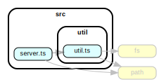

# Udagram Image Filtering Microservice

Udagram is a simple cloud application developed alongside the Udacity Cloud Engineering Nanodegree. It allows users to register and log into a web client, post photos to the feed, and process photos using an image filtering microservice.

The Image Filtering Microservice, the final project in course 2 is a Node-Express application which runs a simple script to process images.

---

## IMPLEMENT A RESTFUL ENDPOINT

```
GET /filteredimage?image_url={{URL}}
```

An endpoint that filters an image from a public url.

### FEATURES



1. validates the image_url query
2. calls filterImageFromURL(image_url) to filter the image
3. sends the resulting file in the response
4. deletes any files on the server on finish of the response

- Click [this link](http://cloud-dev-project-2-udagram-image-filte.ap-southeast-2.elasticbeanstalk.com/filteredimage?image_url=https://motorcycles.honda.com.au/img/2019-CRF250-RALLY-Red-1140x500.jpg) to test the API.

- Or, append your own public image url to this link to filter that image
  ```html
  http://cloud-dev-project-2-udagram-image-filte.ap-southeast-2.elasticbeanstalk.com/filteredimage?image_url=
  ```

> Files are deleted manually by making a PUT call to /delete-files end-point. This is so you can view the collection of filtered images before then removing them. Import the following file in Postman.

```terminal
cloud-dev-project-2-udagram-image-filter.postman_collection.json
```

---

### DEVELOPMENT

- To run locally, clone repo then from project root run ...

```terminal
npm install

npm run dev
```

### DEPLOYMENT

- AWS Elastic Beanstalk CLI commands.

```terminal
andrew@andrew-Alienware-Aurora-R5:~/dev/cloud-dev-project-2-udagram-image-filter$

npm run build

eb init

eb create
```

> For deploying updates, used ...

```terminal
npm run build

eb deploy
```

- AWS Elastic Beanstalk deployed application dashboard.
  
# udagram-image-filter
