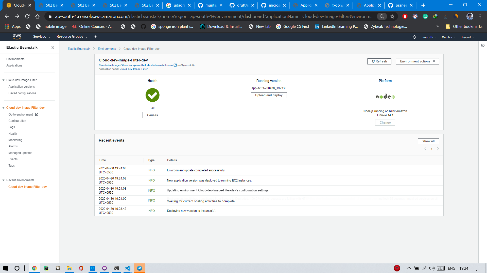

# Udagram Image Filtering Microservice
Tasks
Setup Node Environment

 You'll need to create a new node server. we should open a new terminal within the project directory and run:

    Initialize a new project: npm i
    run the development server with npm run dev

Create a new endpoint in the server.ts file

The starter code has a task for you to complete an endpoint in ./src/server.ts which uses query parameter to download an image from a public URL, filter the image, and return the result.

I included the few helper functions to handle some of the concepts and I importing it for you at the top of the ./src/server.ts file.

import {filterImageFromURL, deleteLocalFiles} from './util/util';

Deploying your system

Follow this process described in the terminal to eb init a new application and eb create the new environment to deploy your image-filter service Don not forget you can use the eb deploy to push changes.


> For deploying used ...

```terminal
   npm run build
   eb init
   eb create
   eb deploy
```

- AWS Elastic Beanstalk deployed application dashboard.
  
## Using the backend
You can test the micro-service by sending a GET request:
```
GET /filteredimage?image_url={{IMAGE_URL}}
```
and
```
http://image-filter-project-seidlr-dev-dev.eu-central-1.elasticbeanstalk.com/filteredimage?image_url=https://www.opensourcecms.com/wp-content/uploads/wordpress-logo.png
```
should return a changed image
